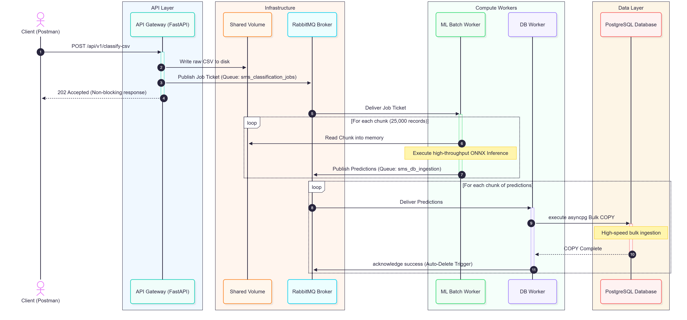

# SMS Microservices Pipeline

A high-performance, containerized microservices backend for batch and real-time SMS classification (Transactional vs. Promotional). This system uses an event-driven architecture to process large datasets asynchronously while protecting system memory through safe data chunking.

_Engineered during my AI/ML Engineering Internship at **Adeona Technologies**._

## System Architecture



The pipeline consists of strictly decoupled services communicating via a message broker to ensure high throughput and fault tolerance:

- **API Gateway (FastAPI):** Central entry point for HTTP REST traffic and live hardware telemetry.
- **Message Broker (RabbitMQ):** Handles reliable asynchronous task queuing with durable queues and auto-purging TTLs.
- **ML Batch Worker (Python/ONNX):** Consumes queued CSV jobs, chunks datasets (25,000 records/chunk), and executes high-speed inference.
- **DB Worker (Python/asyncpg):** Consumes classified payloads and executes bulk `COPY`/`INSERT` operations.
- **Database (PostgreSQL):** Persistent storage utilizing an `asyncpg` connection pool to prevent port exhaustion under high load.

## Core API Endpoints

| Method   | Endpoint                           | Description                                                           |
| :------- | :--------------------------------- | :-------------------------------------------------------------------- |
| **POST** | `/api/v1/classify-csv`             | Upload a CSV for async batch classification (returns `202 Accepted`). |
| **GET**  | `/api/v1/records/metrics/live`     | Live container RAM, host CPU %, and system uptime.                    |
| **GET**  | `/api/v1/records/stats`            | Transactional vs. promotional message counts and ratios.              |
| **GET**  | `/api/v1/records/?page=1&limit=10` | Paginated retrieval of classified records.                            |

## How to Run Locally

1. **Clone the repository:**
   ```bash
   git clone [https://github.com/G-Supun/sms-microservices-pipeline.git](https://github.com/G-Supun/sms-microservices-pipeline.git)
   cd sms-microservices-pipeline
   ```
